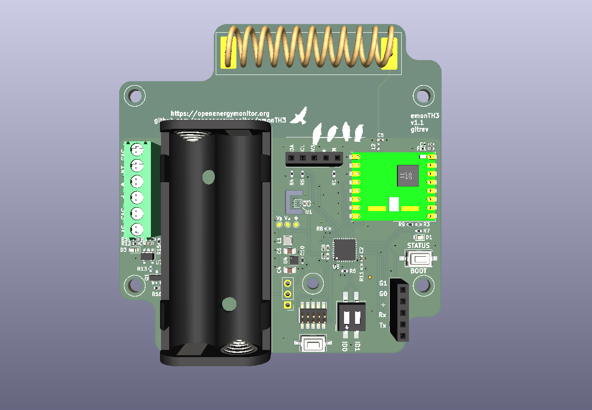

# emonTH3

## Introduction

The _Energy Monitor Temperature Humidity 3_ (emonTH3) is an ultra low power temperature and humidity monitoring node with support for pulse counting and additional external sensors.

It is an update to the [OpenEnergyMonitor](https://openenergymonitor.org) [emonTH2](https://docs.openenergymonitor.org/emonth2/index.html) with the following goals:

- Increase the battery life from the current ~4 years on 2xAA
- Update to modern components
- Reduce the overall cost of the system
- Provide user expansion for other sensors

It should be used with the [emonTH-fw](https://github.com/awjlogan/emonTH-fw) firmware.

## Getting started

The board is designed using [KiCAD](https://www.kicad.org) version 9. The schematic and floorplan are provided as PDF files. If you want to render your own files, run `./generate.py`. This produces Gerber files as well as KiCAD PCB and schematic files tagged with the git commit for traceability.

> [!NOTE]
> The emonTH3 will be available fully assembled and programmed from the OpenEnergyMonitor shop.

## Feedback and Issues

These can be reported:

- as a [GitHub issue](https://github.com/awjlogan/emonTH3/issues)
- on the [OpenEnergyMonitor forums](https://community.openenergymonitor.org/)

## Contributing

As the hardware design flow doesn't quite follow as nicely as software, if you want to contribute a change, please raise an issue as described above and we can collaborate.

After cloning the repository, run `./install-hooks.sh` to add the render on commit.

## References

- [CC-Antenna-DK and Antenna Measurements Summary](https://www.ti.com/lit/an/swra328/swra328.pdf?ts=1738909180441)
- [Camden Boss CBRS01VBK datasheet](https://www.camdenboss.com/camden-boss/cbrs01vbk-room-sensor-enclosure%2c-size-1%2c-vented%2c-black%2c-86x86x25.5mm/c-23/p-24104)

## Acknowledgements

- Glyn Hudson and Trystan Lea @ OpenEnergyMonitor
- Gordon Davidson @ OpenEnergyMonitor Forums

